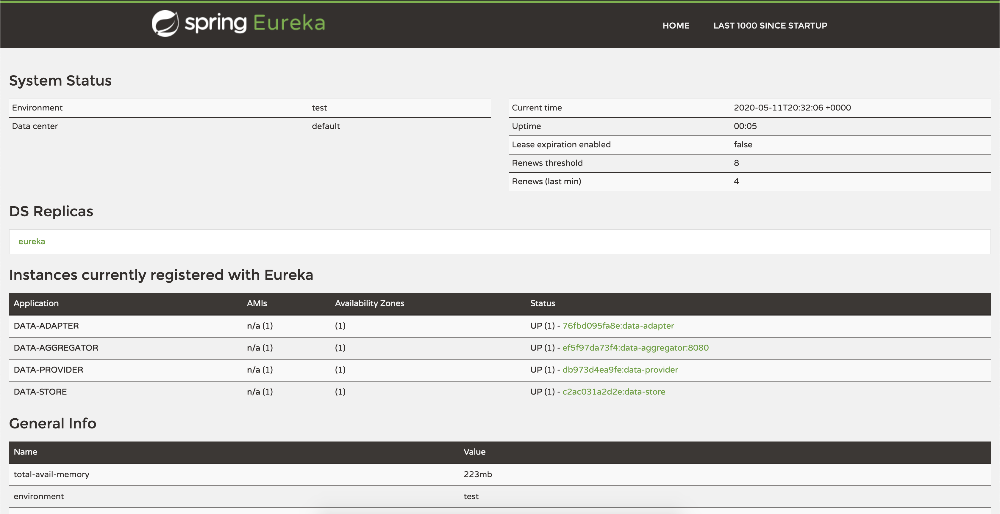
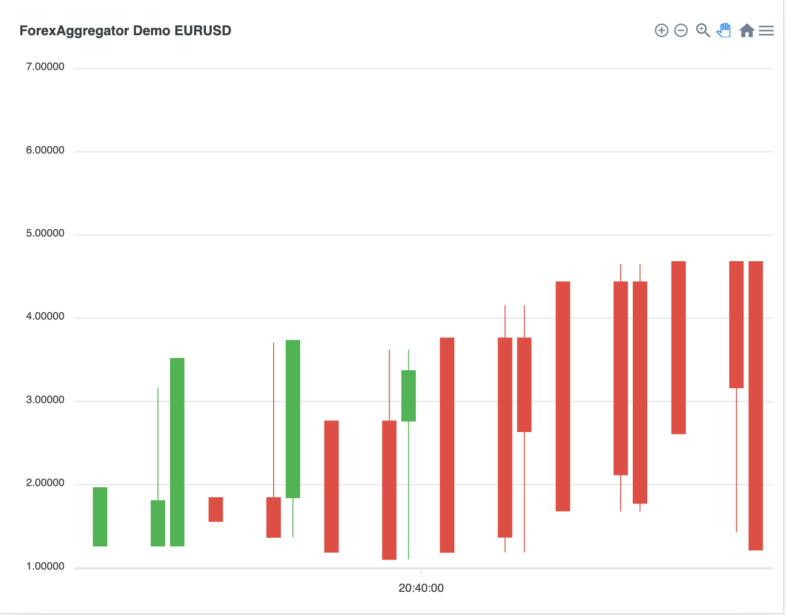
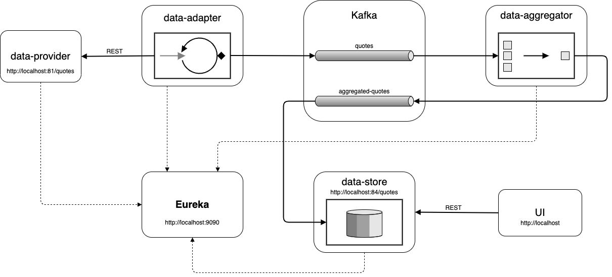

# Forex Aggregator Demo
This project demonstrates use of 
* Spring Boot Web
* Spring Boot Kafka/Kafka streams
* Spring Boot JPA
* Service discovery with Eureka server
* JUnit/Cucumber
* Docker

### Prerequisites
* Java 8
* Maven
* Docker

### Build and run instructions
``` shell script
mvn clean install
docker compose up -d
```
After starting you should see list of 4 services in Eureka dashboard

And after a while aggregated quotes chart


## Data Flow Diagram

#### Links
* [chart](http://localhost)
* [eureka](http://localhost:9090)
* [data-provider](http://localhost:81/quotes)
* [data-store](http://localhost:84/quotes)