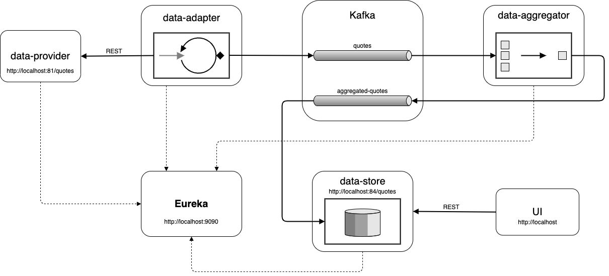

# Forex Aggregator Demo
This project demonstrates use of 
* Spring Boot Web
* Spring Boot Kafka/Kafka streams
* Spring Boot JPA
* Spring Boot Actuator
* Service discovery with Eureka server
* JUnit/Cucumber
* Docker

## Prerequisites
* Java 8
* Maven
* Docker

## Build instructions
``` shell script
mvn clean install
docker compose up -d
```
## Data Flow Diagram

#### Links
* [data-provider](http://localhost:81/quotes)
* [data-store](http://localhost:84/quotes)
* [fontend](http://localhost)
* [eureka](http://localhost:9090)